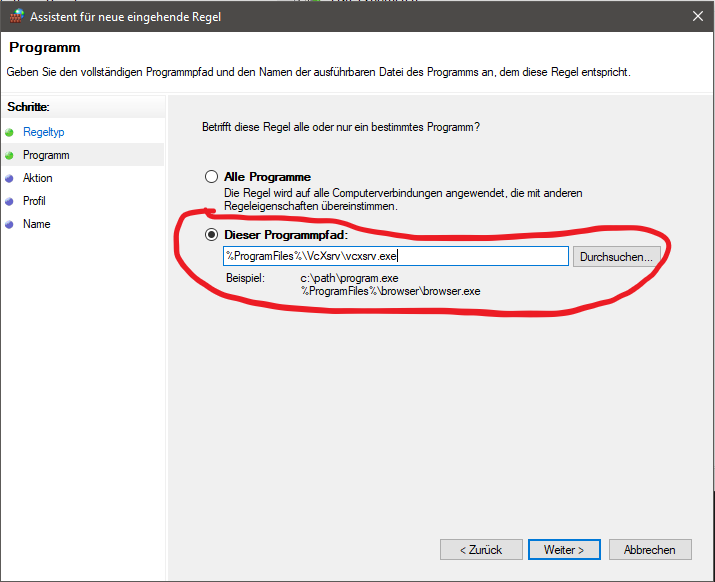
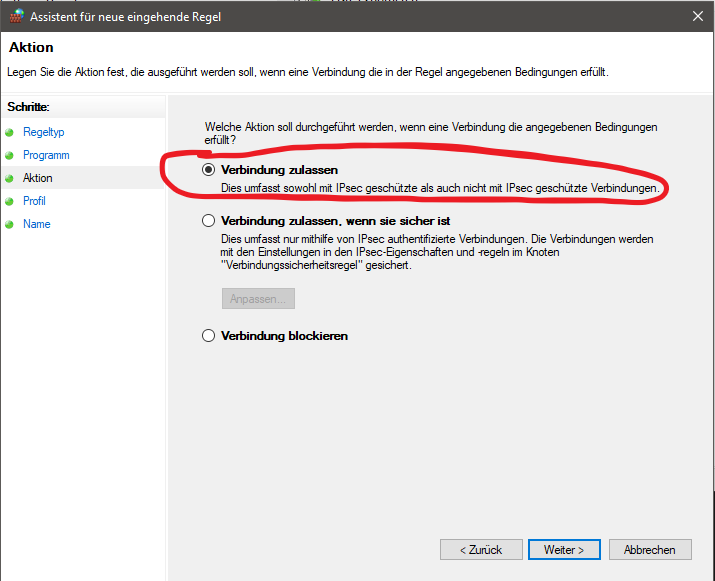
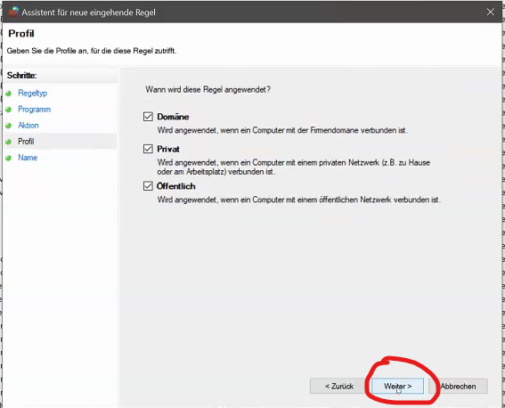
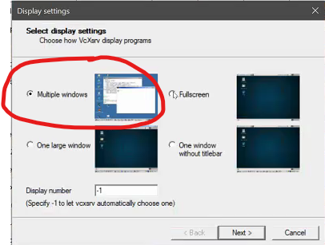
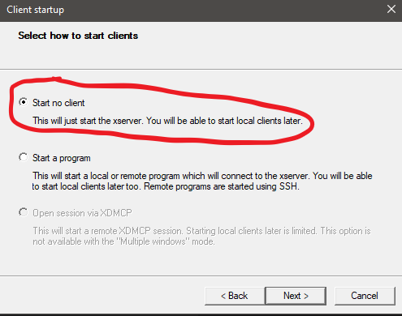
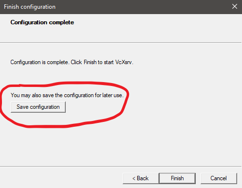

# Setting up Dev Environment

## Check that your Windows is up to date:

```powershell
winver
```

* For x64 systems: **Version 1903** or higher, with **Build 18362** or higher.

## Install WSL 

For installing and enabling WSL you have to run a powershell as administrator.

### Enable Feature

```powershell
dism.exe /online /enable-feature /featurename:Microsoft-Windows-Subsystem-Linux /all /norestart
```
### Enable Virtual Maschine Feature

> This enables WSL2

```powershell
dism.exe /online /enable-feature /featurename:VirtualMachinePlatform /all /norestart
```

**!!! When this command finishes, restart the computer !!!**

### Install updated Linux Kernel

#### Download

https://wslstorestorage.blob.core.windows.net/wslblob/wsl_update_x64.msi

#### Install it!

**!!! When this command finishes, restart the computer !!!**

### Set WSL2 as default

Run this instruction in a **non admin powershell**, otherwise the wsl version will still be 1.

```powershell
wsl --set-default-version  2
```

### Download Ubuntu

https://aka.ms/wslubuntu2004

### Install Ubuntu

Either double click it or run.

```powershell
Add-AppxPackage .\Downloads\Ubuntu_2004.2020.424.0_x64.appx
```

### Make sure Ubuntu is set as default and uses WSL2

Run `wsl -l -v` and make sure that `VERSION` is 2. In case that it is not Version 2.
Uninstall Ubuntu, restart your PC and reinstall Ubuntu.

```powershell
PS C:\Users\wrs***> wsl -l -v
  NAME            STATE           VERSION
* Ubuntu-20.04    Running         2
```

After the installation is finished, open a new **non admin** Powershell

```powershell
 wsl --set-default Ubuntu-20.04 2
```

## Install VcXsrv
### Download and Install

https://sourceforge.net/projects/vcxsrv/

### Configure Firewall to allow for:

Open **Windows Defender Firewall** -> Open **Advanced Settings** -> Add new **in- and outgoing rule**

Choose program:


Use `%ProgramFiles%\VcXsrv\vcxsrv.exe` as path to the program:



Allow the connection:



Choose where the rule will be applied:



choose a name that will explain what the purpose of the rule is: VcXsrv-(in|out)


### Configure VcXsrv to use the following flags:

After installing VcXsrv open `XLaunch` and start the configuration.

Choose multiple windows:



Choose `Start no client`



Set `-multiwindow -clipboard -wgl -ac` as configuration option:


After that save your configuration. You have to launch the configuration-file to be able to run programs from wsl2 as windowed-applications in windows. If you save the configuration you do not have to configure it every time.




## Setup Linux
### Open WSL

```powershell
wsl
```

### Fix DNS handling

```bash
sudo bash -c 'printf "[network]\ngenerateResolvConf = true\n" > /etc/wsl.conf'
```

### Install OS dependencies

```bash
sudo bash -c 'apt update && apt dist-upgrade -y && apt install -y make g++'
```

### Access wsl file system from windows

If you want to access the wsl2 file-system type `\\\wsl$` in the address-bar in the windows `explorer.exe`.

### Access windows file system from wsl

Navigate to `cd /mnt/c/Users/wrs***`. Here you can access the windows directories.

### Switch to your new Home

```bash
cd ~
```

### Create a new SSH Key

Generate ssh key in windows powershell.
```powershell
ssh-keygen
```

Copy the ssh key to the wsl.
```bash
mkdir .ssh
cp /mnt/c/Users/wrs***/.ssh/id_rsa* ~/.ssh/
chmod 400 ~/.ssh/id_rsa
```

### Configure XServer

> Add the following to your .bashrc or .zshrc

```bash
export DISPLAY_NUMBER="0.0"
export DISPLAY=$(grep -m 1 nameserver /etc/resolv.conf | awk '{print $2}'):$DISPLAY_NUMBER
export LIBGL_ALWAYS_INDIRECT=1
```

#### Install/Download Google Chrome
```bash
wget https://dl.google.com/linux/direct/google-chrome-stable\_current\_amd64.deb
```

#### Install Google Chrome 

```bash
sudo apt install ./google-chrome-stable\_current\_amd64.deb
```

#### Test

> You should now be able to run google chrome from within linux. The browser should display itself in Windows as a seemingly native application, if you are running your vcxsrv-configuration.

```bash
google-chrome
```

## Troubleshooting

### Connection problems

If you have trouble connection to services running on wsl2 from windows, add a file with these contents to `C:\Users\wrs***\\.wslconfig.

```powershell
[wsl2]
localhostForwarding=true
```

## Sources

Further reading: https://docs.microsoft.com/en-us/windows/wsl/wsl-config